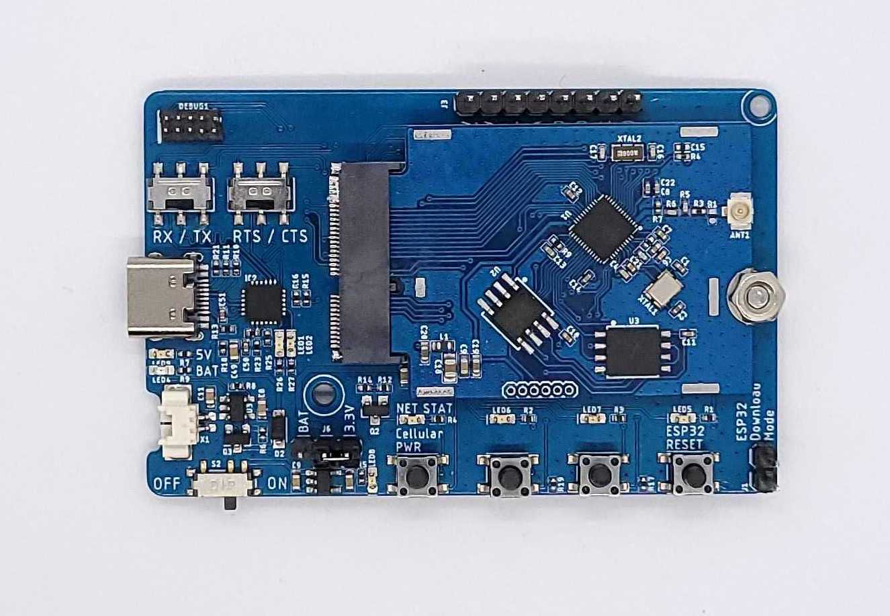
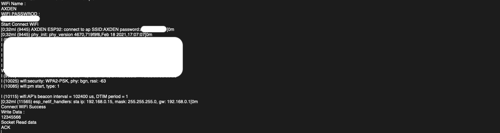

# ESP32 WiFi Example

-----------------------

 

AXDEN ESP32 RTOS WiFi Example

-----------------------

### ESP32 WiFi terminal
 

baudrate : 9600
 

<table>
  <tr align="center">
    <td>WiFi Connect and TCP Socket Write</td>
  </tr>
  <tr align="center">
    <td></td>
  </tr>
</table>
 

-----------------------
